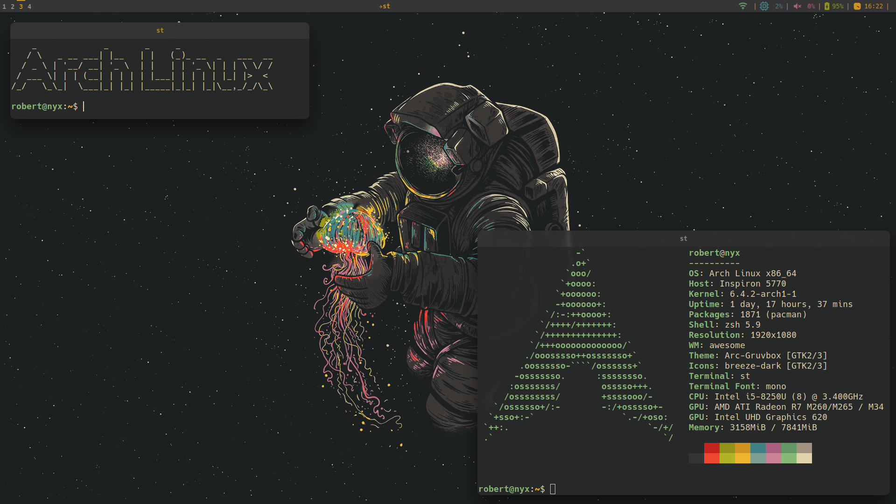

# Dotfiles



These are the dotfiles (= configuration files) that I use for my Arch Linux
system. They are separated into folders that specify the program that uses them
or their purpose. Inside them you'll find the location the files should be added
starting from the home directory.

**Example:**  
The file `dotfiles/git/.config/git/config` should be applied to
`~/.config/git/config`.

**Note:**  
The deployment process can be automated using `stow` (see below for more
information).

Also, be aware that the dotfiles reference some of my scripts which can be found
[here](https://github.com/robert-lag/scripts).

## Usage

### Clone repository
Copy the dotfiles into a subfolder of your home directory (`~`):

```
cd
git clone https://github.com/robert-lag/dotfiles .dotfiles
```

**Note**:  
It's very important that you clone the repository into a subfolder of `~` as
`stow` will use the parent directory as target directory by default. If you want
to clone the repository into a different folder then you always need to use the
`-t <directory>` option when working with `stow`.  
For more information about stow see `man stow` or `stow --help`.

### Install `stow`
Make sure you have installed `stow`.  
On Arch Linux:

```
pacman -S stow
```

### Deploy dotfiles
Then you can deploy all of them simply be using the `stow` command:

```
cd ~/.dotfiles
stow
```

To deploy them individually, you can tell `stow` the directory that should be
deployed:

```
cd ~/.dotfiles
stow git
```
